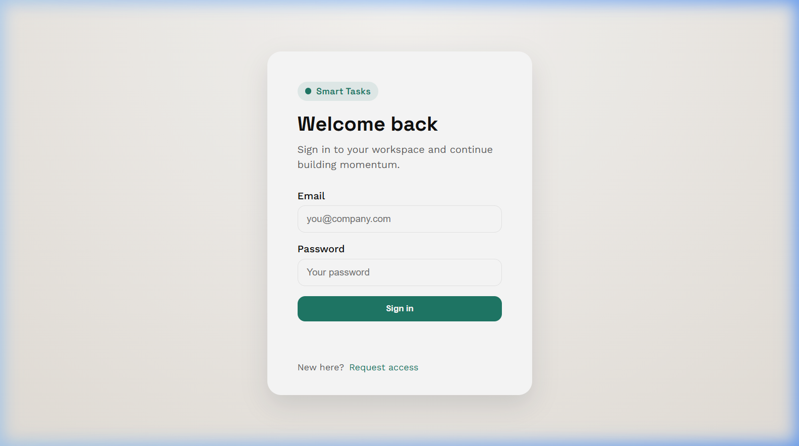
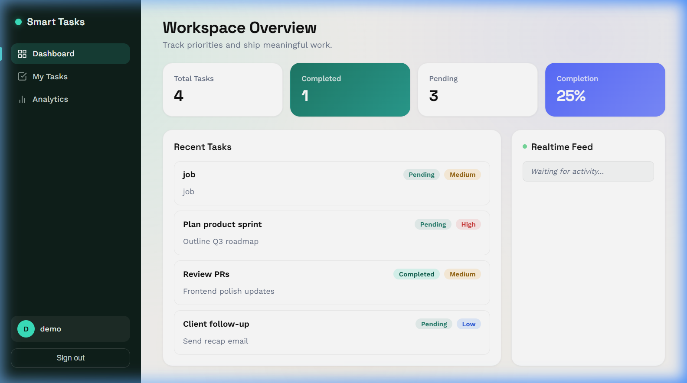
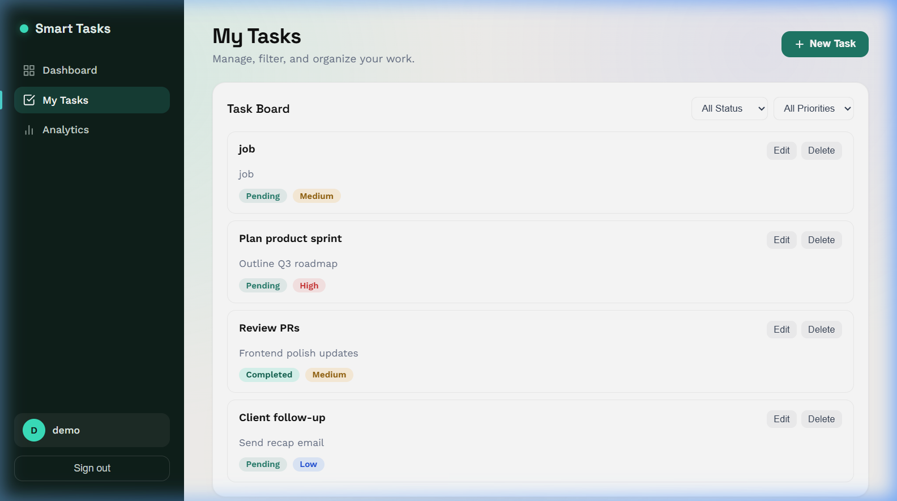
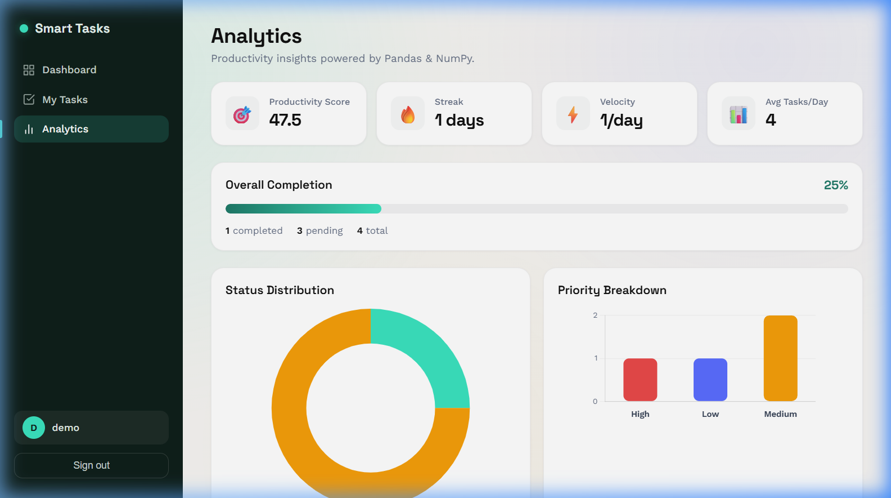
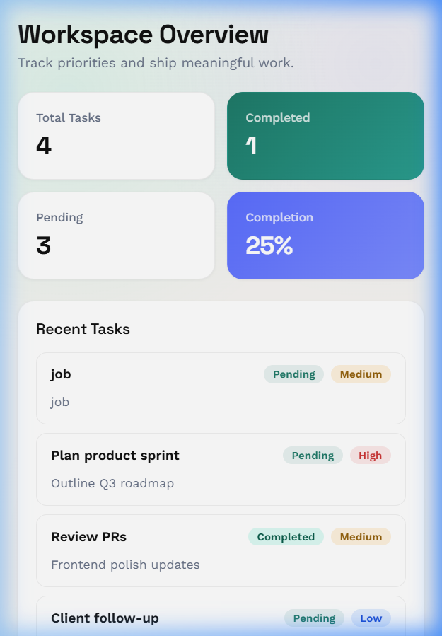

<p align="center">
  
  
  
  
  
  
  
  
</p>

# 🚀 Smart Task Management Platform

A modern, full-stack productivity platform built with **Flask**, **PostgreSQL**, and a premium **SPA-style dashboard**. Features JWT authentication, real-time SocketIO updates, advanced analytics powered by **Pandas & NumPy**, and beautiful **Chart.js** visualizations — all wrapped in a responsive, SaaS-quality interface.

> **Built to demonstrate production-grade full-stack engineering** — clean architecture, real-time data flow, computed analytics, and a polished user experience end to end.

---

## ✨ Features

| Category | Details |
|---|---|
| **🔐 Authentication** | JWT-based register/login/logout with secure token management |
| **📋 Task Management** | Full CRUD with ownership enforcement, priority levels, and status tracking |
| **⚡ Realtime Updates** | SocketIO-powered live feed — instant UI sync across tabs/clients |
| **📊 Analytics Dashboard** | Productivity score, streaks, velocity, completion rates, and distributions |
| **🧮 Data Engine** | Server-side Pandas DataFrames + NumPy computations for all metrics |
| **📈 Visualizations** | Chart.js doughnut & bar charts with smooth animations |
| **🎨 Modern UI** | SPA-style navigation, skeleton loaders, toast notifications, glassmorphism |
| **📱 Responsive** | Fully adaptive layout — desktop, tablet, and mobile optimized |
| **🗄️ PostgreSQL** | Production database with Flask-Migrate schema management |

---

## 📸 Screenshots

<table>
  <tr>
    <td align="center"><b>Login Page</b></td>
    <td align="center"><b>Dashboard Overview</b></td>
  </tr>
  <tr>
    <td></td>
    <td></td>
  </tr>
  <tr>
    <td align="center"><b>Task Management</b></td>
    <td align="center"><b>Analytics Dashboard</b></td>
  </tr>
  <tr>
    <td></td>
    <td></td>
  </tr>
  <tr>
    <td align="center"><b>Realtime Activity Feed</b></td>
    <td align="center"><b>Mobile Responsive</b></td>
  </tr>
  <tr>
    <td></td>
    <td></td>
  </tr>
</table>

---

## 🎬 Demo Video

> **Full walkthrough** — authentication, task management, realtime updates, and analytics in action.

<p align="center">
  <a href="https://github.com/Abhijeet-ojha/assignment/releases/tag/demo">
    
  </a>
</p>

> **Note:** The demo video (~55 MB) is hosted as a [GitHub Release](https://github.com/Abhijeet-ojha/assignment/releases/tag/demo) asset to keep the repository lightweight. Download or stream it directly from the Releases page.

---

## 🏗️ Architecture Overview

```
smart-tasks/
├── run.py                  # Application entry point
├── config.py               # Environment & database configuration
├── requirements.txt        # Python dependencies
├── migrations/             # Flask-Migrate (Alembic) migration scripts
├── scripts/
│   └── seed_demo.py        # Demo data seeder
└── app/
    ├── __init__.py          # Flask app factory + extension wiring
    ├── models/              # SQLAlchemy ORM models
    │   ├── user.py          #   → User model (password hashing)
    │   └── task.py          #   → Task model (priority, status, ownership)
    ├── routes/              # API & page blueprints
    │   ├── auth.py          #   → Register / Login / Me endpoints
    │   ├── tasks.py         #   → CRUD + SocketIO event emitters
    │   ├── analytics.py     #   → Analytics aggregation endpoint
    │   ├── pages.py         #   → HTML page routes (login, dashboard)
    │   └── health.py        #   → Health check endpoint
    ├── services/            # Business logic layer
    │   └── analytics.py     #   → Pandas/NumPy computation engine
    ├── sockets/             # Realtime event handlers
    │   └── events.py        #   → SocketIO connect/disconnect hooks
    ├── templates/           # Jinja2 HTML templates
    │   ├── login.html       #   → Authentication page
    │   └── dashboard.html   #   → SPA dashboard shell
    └── static/
        ├── css/
        │   ├── login.css    #   → Login page styles
        │   └── dashboard.css#   → Full dashboard design system
        └── js/
            ├── auth.js      #   → Login form handler + token storage
            ├── sockets.js   #   → SocketIO client wrapper
            ├── dashboard.js #   → SPA router, state, CRUD, realtime feed
            └── analytics.js #   → Chart.js rendering module
```

### Design Principles

- **App Factory Pattern** — `create_app()` for testable, configurable initialization
- **Layered Architecture** — Models → Services → Routes separation of concerns
- **Event-Driven Updates** — Task mutations emit SocketIO events for live sync
- **Computed Analytics** — No raw SQL aggregation; Pandas DataFrames handle all metric computation
- **Client-Side SPA** — Single-page navigation without framework overhead; vanilla JS with module pattern

---

## 🛠️ Tech Stack

| Layer | Technology |
|---|---|
| **Backend Framework** | Flask 2.x with Blueprints |
| **Database** | PostgreSQL 16 |
| **ORM** | SQLAlchemy + Flask-SQLAlchemy |
| **Migrations** | Flask-Migrate (Alembic) |
| **Authentication** | Flask-JWT-Extended (JSON Web Tokens) |
| **Realtime** | Flask-SocketIO (WebSocket transport) |
| **Data Analytics** | Pandas DataFrames + NumPy |
| **Visualizations** | Chart.js 4.x (doughnut & bar charts) |
| **Frontend** | Vanilla HTML / CSS / JavaScript |
| **Typography** | Google Fonts (Space Grotesk + Work Sans) |

---

## 🚀 Getting Started

### Prerequisites

- Python 3.10+
- PostgreSQL 14+ running locally
- Git

### 1. Clone the repository

```bash
git clone https://github.com/your-username/smart-tasks.git
cd smart-tasks
```

### 2. Create and activate a virtual environment

```bash
python -m venv .venv

# Windows (PowerShell)
.\.venv\Scripts\Activate.ps1

# macOS / Linux
source .venv/bin/activate
```

### 3. Install dependencies

```bash
pip install -r requirements.txt
```

### 4. Configure environment variables

Create a `.env` file in the project root:

```env
DB_TYPE=postgresql
DB_USER=postgres
DB_PASSWORD=your_password
DB_HOST=localhost
DB_PORT=5432
DB_NAME=smart_tasks
SECRET_KEY=your-secret-key
JWT_SECRET_KEY=your-jwt-secret-key
```

> **SQLite fallback:** Set `DB_TYPE=sqlite` to use a local SQLite database for quick testing without PostgreSQL.

### 5. Create the database

```bash
psql -U postgres -c "CREATE DATABASE smart_tasks;"
```

### 6. Run migrations

```bash
flask db upgrade
```

### 7. Seed demo data (optional)

```bash
python scripts/seed_demo.py
```

This creates a demo user: `demo@smarttasks.com` / `DemoPass123`

### 8. Start the application

```bash
python run.py
```

Visit:
- **Login:** [http://localhost:5000/login](http://localhost:5000/login)
- **Dashboard:** [http://localhost:5000/dashboard](http://localhost:5000/dashboard)

---

## 📡 API Endpoints

### Authentication

| Method | Endpoint | Description | Auth |
|--------|----------|-------------|------|
| `POST` | `/auth/register` | Create a new user account | ❌ |
| `POST` | `/auth/login` | Authenticate and receive JWT token | ❌ |
| `GET` | `/auth/me` | Get current user profile | ✅ |

### Tasks (JWT Protected)

| Method | Endpoint | Description |
|--------|----------|-------------|
| `POST` | `/tasks` | Create a new task |
| `GET` | `/tasks` | List user's tasks (supports `?status=` and `?priority=` filters) |
| `PUT` | `/tasks/<id>` | Update a task (title, description, priority, status) |
| `DELETE` | `/tasks/<id>` | Delete a task |

### Analytics (JWT Protected)

| Method | Endpoint | Description |
|--------|----------|-------------|
| `GET` | `/analytics` | Get computed productivity analytics |

### Health

| Method | Endpoint | Description |
|--------|----------|-------------|
| `GET` | `/health` | Server health check |

### Example Requests

<details>
<summary><b>Register</b></summary>

```bash
curl -X POST http://localhost:5000/auth/register \
  -H "Content-Type: application/json" \
  -d '{"username": "john", "email": "john@example.com", "password": "SecurePass123"}'
```

**Response:**
```json
{
  "success": true,
  "message": "registration successful",
  "data": {
    "id": 1,
    "username": "john",
    "email": "john@example.com",
    "created_at": "2026-05-10T12:00:00"
  }
}
```
</details>

<details>
<summary><b>Login</b></summary>

```bash
curl -X POST http://localhost:5000/auth/login \
  -H "Content-Type: application/json" \
  -d '{"email": "john@example.com", "password": "SecurePass123"}'
```

**Response:**
```json
{
  "success": true,
  "message": "login successful",
  "data": {
    "access_token": "<jwt_token>",
    "user": {
      "id": 1,
      "username": "john",
      "email": "john@example.com"
    }
  }
}
```
</details>

<details>
<summary><b>Create Task</b></summary>

```bash
curl -X POST http://localhost:5000/tasks \
  -H "Authorization: Bearer <jwt_token>" \
  -H "Content-Type: application/json" \
  -d '{"title": "Ship v2.0", "description": "Final release prep", "priority": "High", "status": "Pending"}'
```

**Response:**
```json
{
  "success": true,
  "message": "task created",
  "data": {
    "id": 1,
    "title": "Ship v2.0",
    "description": "Final release prep",
    "priority": "High",
    "status": "Pending",
    "created_at": "2026-05-10T12:00:00",
    "user_id": 1
  }
}
```
</details>

<details>
<summary><b>Get Analytics</b></summary>

```bash
curl http://localhost:5000/analytics \
  -H "Authorization: Bearer <jwt_token>"
```

**Response:**
```json
{
  "success": true,
  "message": "analytics retrieved",
  "data": {
    "total_tasks": 10,
    "completed_tasks": 6,
    "pending_tasks": 4,
    "completion_percentage": 60.0,
    "status_distribution": { "Completed": 6, "Pending": 4 },
    "priority_distribution": { "High": 3, "Medium": 5, "Low": 2 },
    "high_priority_ratio": 30.0,
    "priority_completion": {
      "High": { "total": 3, "completed": 2, "ratio": 66.67 },
      "Medium": { "total": 5, "completed": 3, "ratio": 60.0 },
      "Low": { "total": 2, "completed": 1, "ratio": 50.0 }
    },
    "avg_tasks_per_day": 2.5,
    "recent_completions": 3,
    "completion_velocity": 1.2,
    "productivity_score": 72.0,
    "streak_days": 4
  }
}
```
</details>

---

## 📊 Analytics Engine

All analytics are computed server-side using **Pandas DataFrames** and **NumPy** — no raw SQL aggregation.

| Metric | Description | Computation |
|--------|-------------|-------------|
| **Completion %** | Ratio of completed to total tasks | `(completed / total) × 100` |
| **Productivity Score** | Weighted 0–100 score | `((completed × 1.0 + pending × 0.3) / total) × 100` |
| **Status Distribution** | Count per status category | `DataFrame.value_counts()` |
| **Priority Distribution** | Count per priority level | `DataFrame.value_counts()` |
| **High Priority Ratio** | Percentage of high-priority tasks | `np.round((high_count / total) × 100, 2)` |
| **Priority Completion** | Per-priority completion ratios | Boolean mask aggregation per priority group |
| **Avg Tasks/Day** | Mean daily task creation rate | `np.mean(daily_counts)` |
| **Recent Completions** | Tasks completed in last 7 days | Time-filtered boolean mask |
| **Completion Velocity** | Completed tasks per active day | `completed / date_range_days` |
| **Streak Days** | Consecutive days with task activity | Reverse-sorted date iteration |

---

## 🗄️ Database

This project uses **PostgreSQL** as the primary relational database, managed through **Flask-Migrate** (Alembic) for version-controlled schema migrations.

| Component | Details |
|---|---|
| **Engine** | PostgreSQL 16+ |
| **ORM** | SQLAlchemy + Flask-SQLAlchemy |
| **Migrations** | Flask-Migrate (Alembic) — `migrations/` |
| **Schema Export** | `database/schema.sql` — full DDL (tables, constraints, foreign keys) |
| **Seed Script** | `scripts/seed_demo.py` — demo user & sample tasks |

### Schema Overview

```
users
├── id              (PK, serial)
├── username        (varchar 80, NOT NULL)
├── email           (varchar 120, UNIQUE, NOT NULL)
├── password_hash   (varchar 255, NOT NULL)
└── created_at      (timestamp, DEFAULT CURRENT_TIMESTAMP)

tasks
├── id              (PK, serial)
├── title           (varchar 200, NOT NULL)
├── description     (text, nullable)
├── priority        (varchar 20, NOT NULL, default 'Medium')
├── status          (varchar 20, NOT NULL, default 'Pending')
├── created_at      (timestamp, DEFAULT CURRENT_TIMESTAMP)
└── user_id         (FK → users.id, NOT NULL)
```

> **Note:** The full PostgreSQL DDL export is available at [`database/schema.sql`](database/schema.sql) — suitable for recreating the database without running migrations.

---

## ⚡ Realtime Features (SocketIO)

The platform uses **Flask-SocketIO** for bidirectional WebSocket communication. When any task is created, updated, or deleted, the server emits an event to all connected clients.

### Events

| Event | Trigger | Payload |
|-------|---------|---------|
| `task_created` | New task saved | `{ "task": { id, title, status, priority, ... } }` |
| `task_updated` | Task modified | `{ "task": { id, title, status, priority, ... } }` |
| `task_deleted` | Task removed | `{ "task": { id, title, ... } }` |
| `client_connected` | Client connects | `{ "message": "connected" }` |

### Client-Side Behavior

- **Realtime feed** prepends new events (newest first, capped at 10)
- **Dashboard metrics** auto-refresh on task events
- **Task list** re-renders when mutations are detected
- **Analytics charts** recompute on next view switch
- **Toast notifications** confirm realtime connection status

---

## 🎯 Demo Flow

1. **Register** a new account or use the seeded demo user
2. **Dashboard** — View workspace overview with live metrics and activity feed
3. **My Tasks** — Create, edit, filter, and delete tasks with instant feedback
4. **Realtime** — Open a second tab to see live updates across clients
5. **Analytics** — Explore productivity score, streak, velocity, and chart visualizations
6. **Mobile** — Resize the browser to see the responsive layout adapt

---

## 📁 Project Structure

```
smart-tasks/
├── .env                    # Environment variables (git-ignored)
├── .gitignore              # Exclusions for venv, cache, env, db files
├── config.py               # Centralized configuration with DB URI builder
├── requirements.txt        # Pinned Python dependencies
├── run.py                  # SocketIO-powered app launcher
├── database/
│   └── schema.sql          # PostgreSQL schema export (DDL only)
├── demo/
│   └── demo_video.mp4      # Full walkthrough recording (git-ignored)
├── migrations/             # Alembic migration versions
├── scripts/
│   └── seed_demo.py        # Demo data seeder
├── screenshots/            # Application screenshots for README
└── app/                    # Main application package
    ├── models/             # Data layer (User, Task)
    ├── routes/             # HTTP & page endpoints
    ├── services/           # Business logic (analytics engine)
    ├── sockets/            # WebSocket event handlers
    ├── static/             # CSS, JS, images
    └── templates/          # HTML templates
```

---

## 🔮 Future Improvements

- [ ] Per-user SocketIO rooms for scoped broadcasts
- [ ] Task search with full-text filtering
- [ ] JWT refresh token rotation
- [ ] Task due dates and calendar view
- [ ] CI/CD pipeline with automated testing
- [ ] Docker containerization
- [ ] Role-based access control (RBAC)
- [ ] Dark mode toggle

---

## 📄 License

MIT

---

<p align="center">
  <sub>Built with ❤️ as a portfolio showcase — demonstrating full-stack Flask engineering, real-time data, and modern frontend craftsmanship.</sub>
</p>
